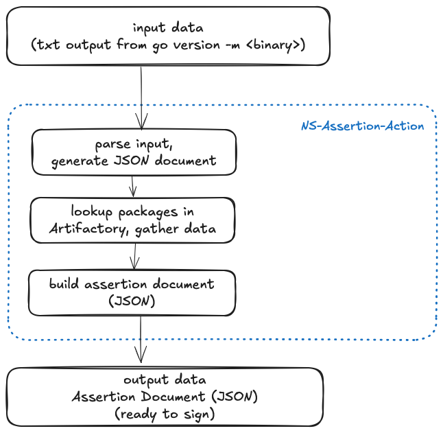

# ns-assertion-action

`ns-assertion-action` is a GitHub Action for generating assertion documents.

The `ns-assertion-action` generates the assertion document for the Go binary built in the pipeline.

## Data flow



## Prerequisites

The action takes the input string representing output from the `go version -m <binary>` command.
The command retrospects the Go binary and lists included Go packages.

## Configuration

### Required input data

The action require text input data representing raw output from the Go command `go version -m <binary>`.

Example:

```yaml
- name: Generate Assertion Document
      id: assertiondoc
      uses: nginxinc/compliance-rules/.github/actions/assertion@feat/assertion
      with:
        artifact-name: ptdcli_${{ github.ref_name }}
        artifact-digest: 'test-digest'
        build-type: 'github'
        builder-id: 'github.com'
        builder-version: '0.1.0-xyz'
        invocation-id: ${{ github.run_id }}.${{ github.run_number }}.${{ github.run_attempt }}
        artifactory-user: ${{ secrets.ARTIFACTORY_USER }}
        artifactory-api-token: ${{ secrets.ARTIFACTORY_TOKEN }}
        artifactory-url: ${{ secrets.ARTIFACTORY_URL }}
        artifactory-repo: 'f5-nginx-go-local-approved-dependency'
        assertion-doc-file: assertion_ptdcli_${{ github.ref_name }}.json
        build-content-path: ${{ steps.godeps.outputs.goversionm }}

```
