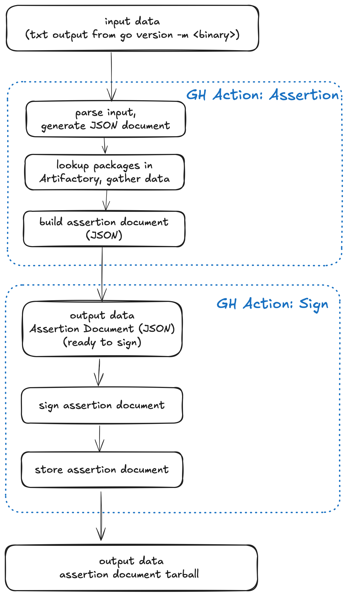

# Compliance-rules

Compliance repo with main rules for SCA and SAST scan

This repository provides common GitHub Actions and GitHub workflows for code scans and generating SBOM documents.

## Table of Content

- [Configure Mend workflow](#configure-mend-workflow-in-a-github-repository)
- [Configure CodeQL workflow](#configure-codeql-workflow-in-a-github-repository)
- [Configure Assertion Document workflow](#configure-assertion-document-workflow)
- [Configure SBOM workflow for Go projects](#sbom-documents-for-go-projects)

## Configure Mend workflow in a GitHub repository

- Create `mend.yml` workflow in your project repository

```yaml
name: Mend

on:
  push:
    branches:
      - main
  pull_request:
    branches:
      - main
  workflow_dispatch:
    inputs:
      branch:
        type: string
        required: false
        default: main
  workflow_call:
    inputs:
      branch:
        type: string
        required: true

permissions:
  contents: read

jobs:
  mend:
    uses: nginxinc/compliance-rules/.github/workflows/mend.yml@<git_tag>
    secrets: inherit
    with:
      product_name: <caller_product_name>_${{ github.head_ref || github.ref_name }}
      project_name: <caller_project_name>
```

- In the `mend` job reference the main mend workflow (in this repository)

```yaml
uses: nginxinc/compliance-rules/.github/workflows/mend.yml@<git_tag>
```

- Configure `product_name` and `project_name` variables. They represent caller github repository `product` and `project` name.

```yaml
product_name: <caller_product_name>_${{ github.head_ref || github.ref_name }}
project_name: <caller_project_name>
```

### Mend workflow

1. GitHub triggers the mend workflow defined in a project repository (for example `ProjectABC`)
1. Mend job references mend rules (main `mend.yml`) defined in the workflow in this repository.
1. Mend scans the `ProjectABC` code and generates vulenerability report.
1. Depends on the scan (vulnerability) rules defined in the main `mand.yml` the pipeline fails or passes the scan.
1. The GitHub repository (`ProjectA`) must be configured to reject PRs (prevent from merging with the `main` branch) if the mend pipeline fails.  

## Configure CodeQL workflow in a GitHub repository

- Create `codeql.yml` workflow in your project repository

```yaml
name: "CodeQL"

on:
  push:
    branches:
      - main
  pull_request:
    branches:
      - main
  workflow_dispatch:
    inputs:
      branch:
        type: string
        required: false
        default: main
  workflow_call:
    inputs:
      branch:
        type: string
        required: true

concurrency:
  group: ${{ github.ref_name }}-codeql
  cancel-in-progress: true

permissions:
  contents: read

jobs:
  codeql:
    uses: nginxinc/compliance-rules/.github/workflows/codeql.yml@<git_tag>
    with:
      requested_languages: go
```

- In the `codeql` job reference the main `codeql` workflow (in this repository)

```yaml
uses: nginxinc/compliance-rules/.github/workflows/codeql.yml@<git_tag>
```

### CodeQL workflow

1. GitHub triggers the CodeQL workflow defined in a project repository (for example `ProjectABC`)
1. CodeQL job references `codeql` rules (main `codeql.yml`) defined in the workflow in this repository.
1. CodeQL analyses the `ProjectABC` code.
1. Depends on the results the pipeline fails or passes.
1. The GitHub repository (`ProjectA`) must be configured to reject PRs (prevent from merging with the `main` branch) if the codeql detects issues and the pipeline fails.  

## Configure Assertion Document Workflow

### Data flow



#### GitHub Action Assertion - Configuration

In your project release workflow add a step for generating the assertion document.

The assertion action require input var `build-content-path` that represents a text file with content from the `go version -m <binary>` command where `binary` represents compiled Go binary, for example `agent`.

The full list of required variables:

- `artifact-name` - unique name of the binary built in the pipeline
- `artifact-digest` - calculated digest
- `build-type` - github or gitlab
- `builder-id` - github.com
- `builder-version`
- `invocation-id` - unique id for the build pipeline
- `artifactory-user` - `ARTIFACTORY_USER` stored in github org secrets (`secrets.ARTIFACTORY_USER`)
- `artifactory-api-token` - `ARTIFACTORY_TOKEN` stored in github org secrets (`secrets.ARTIFACTORY_TOKEN`)
- `artifactory-url` - `ARTIFACTORY_URL` stored in github org secrets (`secrets.ARTIFACTORY_URL`)
- `artifactory-repo` - Artifactory repository used for pulling build dependencies - for example `f5-nginx-go-local-approved-dependency`
- `assertion-doc-file` - file generated by the action `assertion_${{ unique identifier }}.json`
- `build-content-path` - file containing output from `go version -m` command executed against the binary
- `started-on` - start time
- `finished-on` - end time
- `log-level` - setup log level for assertion action. Default value: `INFO`. Allowed values `DEBUG`, `WARN`, `ERROR`.

After successful run the action produces an assertion document in JSON format. The Sign Action takes the document, signes it, and stores in GitHub storage.

Example:

```yaml
- name: Generate Assertion Document
  id: assertiondoc
  uses: nginxinc/compliance-rules/.github/actions/assertion@<git-tag>
  with:
    artifact-name: ${{ github.event.repository.name }}_${{ github.sha }}_${{ github.run_number }}_${{ matrix.gateway.os }}_${{ matrix.gateway.arch }}
    artifact-digest: ${{ matrix.gateway.digest }}
    build-type: 'github'
    builder-id: 'github.com'
    builder-version: '0.1.0-xyz'
    invocation-id: ${{ github.run_id }}.${{ github.run_number }}.${{ github.run_attempt }}
    artifactory-user: ${{ secrets.ARTIFACTORY_USER }}
    artifactory-api-token: ${{ secrets.ARTIFACTORY_TOKEN }}
    artifactory-url: ${{ secrets.ARTIFACTORY_URL }}
    artifactory-repo: 'f5-nginx-go-local-approved-dependency'
    assertion-doc-file: assertion_${{ github.event.repository.name }}_${{ github.sha }}_${{ github.run_id }}_${{ github.run_number }}_${{ matrix.gateway.os }}_${{ matrix.gateway.arch }}.json
    build-content-path: ${{ steps.godeps.outputs.goversionm }}
    started-on: ${{ github.event.head_commit.timestamp || github.event.created_at }}
    finished-on: ${{ github.event.head_commit.timestamp || github.event.created_at }}
    log-level: 'DEBUG'
```

#### GitHub Action Sign - Configuration

The `Sign` action takes a path to the generated assertion document, signs it, and stores signed doc in GitHub.

The list of required variables:

- `assertion-doc` - path to the file generated by the `Assertion` GH Action - (`assertion-doc-file`)

Example:

```yaml
- name: Sign and Store Assertion Document
  id: sign
  uses: nginxinc/compliance-rules/.github/actions/sign@<git-tag>
  with:
    assertion-doc: ${{ steps.assertiondoc.outputs.assertion-document-path }}
```

## SBOM documents for Go projects

This section describes how to configure GitHub workflows to generate SBOM documents for both Go binaries and Go source code.

SBOMs generated for a binary are intended for customers, while SBOM documents generated from source code for internal use.

### Generating SBOM for Go binary

To generate SBOMs for Go binaries use GitHub Action [sbom](https://github.com/nginxinc/compliance-rules/tree/main/.github/actions/sbom).

#### Configuration

The code snippet below illustrates how to include SBOM step in GitHub workflow and what parameters to pass to the action.

You can reference version of the SBOM Action by using `sha` (`git_ref` in the example below) and adding a comment with corresponding git tag, for example:

```shell
uses: nginxinc/compliance-rules/.github/actions/sbom@0aab935582c35a00e2c671d8fe25b7fdd72a927b # v0.3.1
```

Below if the full example of the GitHub workflow step that generates SBOM document for the Go binary. The path to the binary is assigned to the `binary-name` variable.

```yaml
- name: Generate SBOM from binary
  uses: nginxinc/compliance-rules/.github/actions/sbom@<git_ref> # <git_tag>
  with:
    binary-name: ${{ steps.check.outputs.binary-path }}
    product-name: ${{ github.event.repository.name }}
    release-version: ${{ github.ref_name }}
    artifactory-user: ${{ secrets.ARTIFACTORY_USER }}
    artifactory-token: ${{ secrets.ARTIFACTORY_TOKEN }}
    az-vault-client-id: ${{ secrets.AZ_VAULT_SEC_CLIENT_ID }}
    az-vault-tenant-id: ${{ secrets.AZ_VAULT_SEC_TENANT_ID }}
    az-vault-subscription-id: ${{ secrets.AZ_VAULT_SEC_SUBSCRIPTION_ID }}
```

where:

- `git_ref` can be sha, git tag or branch
- `git_tag` is a git tag corresponding to the sha

The `sbom` action expects the following parameters:

- `binary-name` - path to the Go binary created in previous step(s)
- `product-name` - usually it's git repository name (wihout the organization name), for example `agent`
- `release-version` - git tag, for example `v1.2.2`, or release branch name, for example `release-1.2.2`
- `artifactory-user` - secrets.ARTIFACTORY_USER
- `artifactory-token` - secrets.ARTIFACTORY_TOKEN

NGINX Security Team specific secrets set at the repository level:

- `az-vault-client-id` - secrets.AZ_VAULT_SEC_CLIENT_ID
- `az-vault-tenant-id` - secrets.AZ_VAULT_SEC_TENANT_ID
- `az-vault-subscription-id` - secrets.AZ_VAULT_SEC_SUBSCRIPTION_ID

### Generating SBOM for Go source code

To generate SBOMs for Go source code use GitHub Action [sbom-source](https://github.com/nginxinc/compliance-rules/tree/main/.github/actions/sbom-source).

You can reference version of the SBOM Action by using `sha` (`git_ref` in the example below) and adding a comment with corresponding git tag, for example:

```shell
uses: nginxinc/compliance-rules/.github/actions/sbom-source@0aab935582c35a00e2c671d8fe25b7fdd72a927b # v0.3.1
```

```yaml
- name: Generate SBOM from source code
  uses: nginxinc/compliance-rules/.github/actions/sbom-source@<git_ref> # <git_tag>
  with:
    product-name: ${{ github.event.repository.name }}
    release-version: ${{ github.ref_name }}
    artifactory-user: ${{ secrets.ARTIFACTORY_USER }}
    artifactory-token: ${{ secrets.ARTIFACTORY_TOKEN }}
    az-vault-client-id: ${{ secrets.AZ_VAULT_SEC_CLIENT_ID }}
    az-vault-tenant-id: ${{ secrets.AZ_VAULT_SEC_TENANT_ID }}
    az-vault-subscription-id: ${{ secrets.AZ_VAULT_SEC_SUBSCRIPTION_ID }}
```

where:

- `git_ref` can be sha, git tag or branch
- `git_tag` is a git tag corresponding to the sha

The `sbom-source` action expects the following parameters:

- `product-name` - usually it's git repository name (wihout the organization name), for example `agent`
- `release-version` - git tag, for example `v1.2.2`, or release branch name, for example `release-1.2.2`
- `artifactory-user` - secrets.ARTIFACTORY_USER
- `artifactory-token` - secrets.ARTIFACTORY_TOKEN

NGINX Security Team specific secrets set at the repository level:

- `az-vault-client-id` - secrets.AZ_VAULT_SEC_CLIENT_ID
- `az-vault-tenant-id` - secrets.AZ_VAULT_SEC_TENANT_ID
- `az-vault-subscription-id` - secrets.AZ_VAULT_SEC_SUBSCRIPTION_ID
