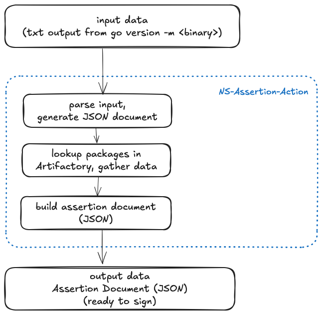

# Compliance-rules

Compliance repo with main rules for SCA and SAST scan

This repository provides common GitHub workflows for Mend and CodeQL scans.

## Configure Mand workflow in a GitHub repository

- Create `mend.yml` workflow in your project repository

```yaml
name: Mend

on:
  push:
    branches:
      - main
  pull_request:
    branches:
      - main
  workflow_dispatch:
    inputs:
      branch:
        type: string
        required: false
        default: main
  workflow_call:
    inputs:
      branch:
        type: string
        required: true

permissions:
  contents: read

jobs:
  mend:
    uses: nginxinc/compliance-rules/.github/workflows/mend.yml@<git_tag>
    secrets: inherit
    with:
      product_name: <caller_product_name>_${{ github.head_ref || github.ref_name }}
      project_name: <caller_project_name>
```

- In the `mend` job reference the main mend workflow (in this repository)

```yaml
uses: nginxinc/compliance-rules/.github/workflows/mend.yml@<git_tag>
```

- Configure `product_name` and `project_name` variables. They represent caller github repository `product` and `project` name.

```yaml
product_name: <caller_product_name>_${{ github.head_ref || github.ref_name }}
project_name: <caller_project_name>
```

### Mend workflow

1. GitHub triggers the mend workflow defined in a project repository (for example `ProjectABC`)
1. Mend job references mend rules (main `mend.yml`) defined in the workflow in this repository.
1. Mend scans the `ProjectABC` code and generates vulenerability report.
1. Depends on the scan (vulnerability) rules defined in the main `mand.yml` the pipeline fails or passes the scan.
1. The GitHub repository (`ProjectA`) must be configured to reject PRs (prevent from merging with the `main` branch) if the mend pipeline fails.  

## Configure CodeQL workflow in a GitHub repository

- Create `codeql.yml` workflow in your project repository

```yaml
name: "CodeQL"

on:
  push:
    branches:
      - main
  pull_request:
    branches:
      - main
  workflow_dispatch:
    inputs:
      branch:
        type: string
        required: false
        default: main
  workflow_call:
    inputs:
      branch:
        type: string
        required: true

concurrency:
  group: ${{ github.ref_name }}-codeql
  cancel-in-progress: true

permissions:
  contents: read

jobs:
  codeql:
    uses: nginxinc/compliance-rules/.github/workflows/codeql.yml@<git_tag>
    with:
      requested_languages: go
```

- In the `codeql` job reference the main `codeql` workflow (in this repository)

```yaml
uses: nginxinc/compliance-rules/.github/workflows/codeql.yml@<git_tag>
```

### CodeQL workflow

1. GitHub triggers the CodeQL workflow defined in a project repository (for example `ProjectABC`)
1. CodeQL job references `codeql` rules (main `codeql.yml`) defined in the workflow in this repository.
1. CodeQL analyses the `ProjectABC` code.
1. Depends on the results the pipeline fails or passes.
1. The GitHub repository (`ProjectA`) must be configured to reject PRs (prevent from merging with the `main` branch) if the codeql detects issues and the pipeline fails.  

## Configure Assertion Document Workflow

### Data flow



#### GitHub Action Assertion - Configuration

In your project release workflow add a step for generating the assertion document.

The assertion action require input var `build-content-path` that represents a text file with content from the `go version -m <binary>` command where `binary` represents compiled Go binary, for example `agent`.

The full list of required variables:

- `artifact-name` - unique name of the binary built in the pipeline
- `artifact-digest` - calculated digest
- `build-type` - github or gitlab
- `builder-id` - github.com
- `builder-version`
- `invocation-id` - unique id for the build pipeline
- `artifactory-user`
- `artifactory-api-token`
- `artifactory-url`
- `artifactory-repo` - Artifactory repository used for pulling build dependencies, for example 'f5-nginx-go-local-approved-dependency'
- `assertion-doc-file` - file generated by the action `assertion_${{ unique identifier }}.json`
- `build-content-path` - file containing output from `go version -m` command executed against the binary

After successful run the action produces an assertion document in JSON format. The document needs to be signed and stored for further processing.

Example:

```yaml
- name: Generate Assertion Document
      id: assertiondoc
      uses: nginxinc/compliance-rules/.github/actions/assertion@main
      with:
        artifact-name: ptdcli_${{ github.ref_name }}
        artifact-digest: 'test-digest'
        build-type: 'github'
        builder-id: 'github.com'
        builder-version: '0.1.0-xyz'
        invocation-id: ${{ github.run_id }}.${{ github.run_number }}.${{ github.run_attempt }}
        artifactory-user: ${{ secrets.ARTIFACTORY_USER }}
        artifactory-api-token: ${{ secrets.ARTIFACTORY_TOKEN }}
        artifactory-url: ${{ secrets.ARTIFACTORY_URL }}
        artifactory-repo: 'f5-nginx-go-local-approved-dependency'
        assertion-doc-file: assertion_ptdcli_${{ github.ref_name }}.json
        build-content-path: ${{ steps.godeps.outputs.goversionm }}
```

#### GitHub Action Sign - Configuration

The `Sign` action takes a path to the generated assertion document, signs the document and stores it in GitHub.

The list of required variables:

- `assertion-doc` - path to the file generated by the `Assertion` GH Action - (`assertion-doc-file`)

Example:

```yaml
- name: Sign and Store Assertion Document
      id: sign
      uses: nginxinc/compliance-rules/.github/actions/sign@feat/assertion
      with:
        assertion-doc: ${{ steps.verify_assertion.outputs.assertiondocument }}
```
